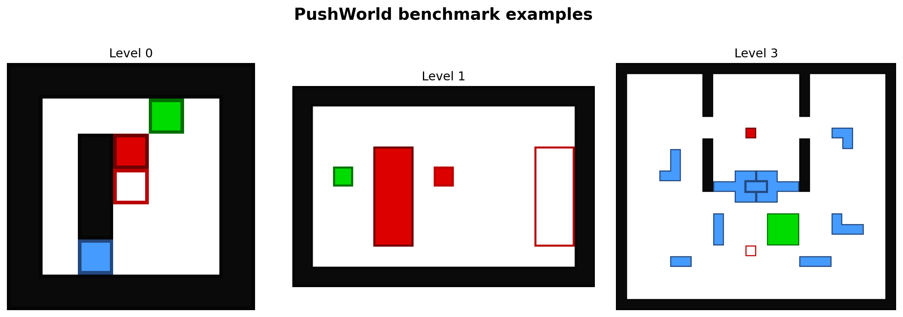
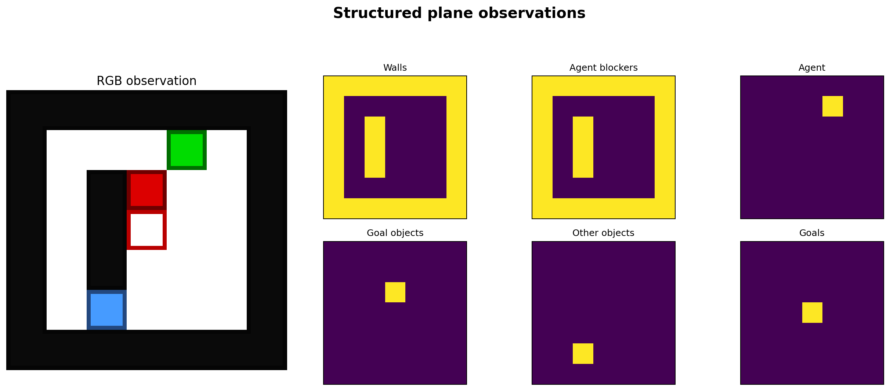
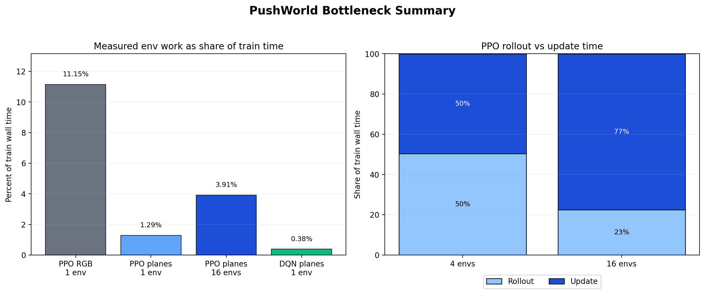
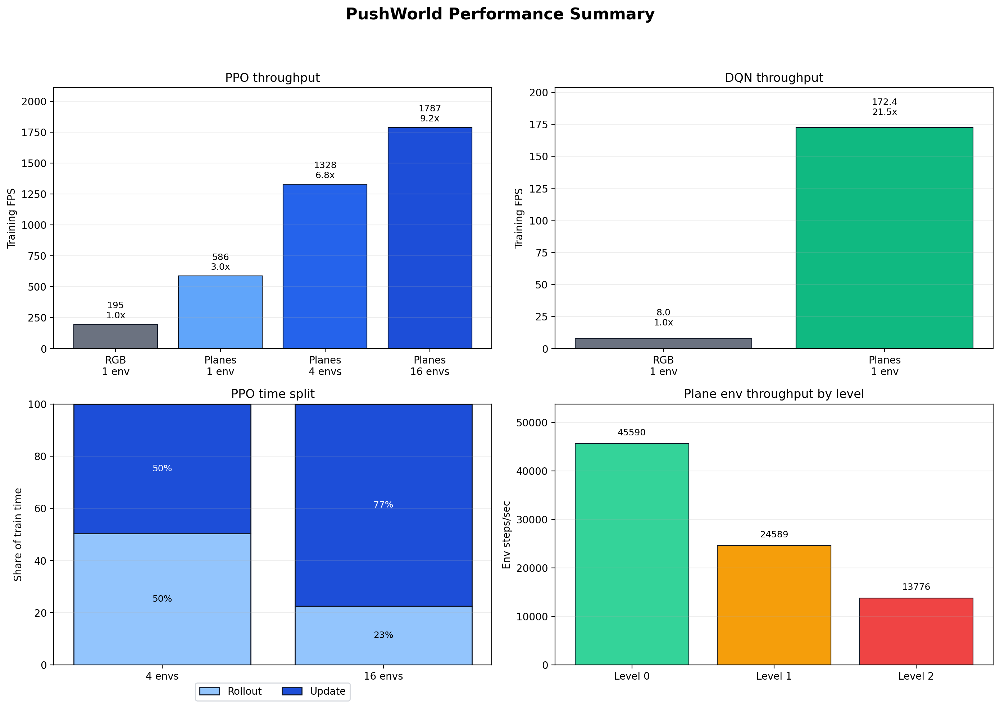

# PushWorld Learned Search Study

This repository is a research workspace around the
[DeepMind PushWorld benchmark](https://github.com/google-deepmind/pushworld).
The current focus is inference-time optimization of a frozen learned planning
policy: prediction caching, value-guided search, stochastic sampling, and
GPU-oriented rollout experiments.

The latest learned-search experiments use a fixed imitation-learning checkpoint
trained on Level-0 expert traces from the official C++ N+RGD planner. All
optimization results below keep the model weights frozen and compare only the
inference/search pipeline on the 68 original Level-1 puzzles.

## Repository Layout

- `external/pushworld` - PushWorld checkout/submodule used by the experiments.
  In the current optimization layout, the original benchmark puzzles are under
  `external/pushworld/external/pushworld/benchmark/puzzles`.
- `src/pushworld_study` - local study code, wrappers, training scripts, and
  benchmark utilities.
- `scripts/train_planner_imitation_v2.py` - imitation-learning training script
  for the transformer policy.
- `scripts/eval_planner_imitation.py` - evaluation entry point for beam,
  best-first, CEM, GPU sampling, and particle rollout experiments.
- `scripts/planner_imitation_rollout.py` - shared rollout/search logic.
- `docs/literature_review.md` - short literature and project survey.
- `docs/optimization_benchmark_plan.md` - staged plan for profiling and
  optimization experiments.
- `docs/planner_imitation_time_optimization_results.md` - detailed timing and
  optimization report.
- `docs/final_presentation/` - final LaTeX presentation and speaker script.

## Setup

This project uses [uv](https://docs.astral.sh/uv/) and keeps uv's cache inside
the project via [uv.toml](uv.toml):

```bash
uv cache dir
```

Expected output:

```text
.uv-cache
```

Clone with submodules, or initialize the submodule after cloning:

```bash
git submodule update --init --recursive
```

Create/update the environment:

```bash
uv sync
```

The upstream PushWorld Python code is not packaged as a normal wheel. The local
helpers add `external/pushworld/python3/src` to `sys.path` at runtime, and the
study code provides a native Gymnasium environment that reuses the official
puzzle parser, transition function, and renderer without importing the legacy
Gym wrapper.

## First Smoke Test

After `uv sync`, run:

```bash
uv run pushworld-study smoke-env
```

This checks that the native Gymnasium environment loads one official benchmark
puzzle, resets, and executes a few random actions.

Measure native environment throughput:

```bash
uv run pushworld-study profile-env --episodes 10 --max-steps 100
```

Install RL dependencies:

```bash
uv sync --group rl
```

Run short baseline smoke trainings:

```bash
uv run pushworld-study train-baseline ppo --total-timesteps 128
uv run pushworld-study train-baseline dqn --total-timesteps 16
```

These commands are integration checks, not meaningful learning experiments.
They save models under `models/` and TensorBoard logs under `runs/`.

Evaluate a saved model on held-out puzzles:

```bash
uv run pushworld-study eval-baseline ppo \
  models/ppo_smoke_seed0_100000.zip \
  --puzzle-path data/level0/base/test \
  --max-episodes 200
```

Run PPO with periodic held-out evaluation and best-checkpoint saving:

```bash
uv run pushworld-study train-baseline ppo \
  --puzzle-path data/level0/base/train \
  --eval-puzzle-path data/level0/base/test \
  --eval-freq 5000 \
  --n-eval-episodes 50 \
  --total-timesteps 100000 \
  --device cuda
```

Use compact structured observations instead of RGB pixels:

```bash
uv run pushworld-study train-baseline ppo \
  --puzzle-path data/debug/base_train_5 \
  --eval-puzzle-path data/debug/base_train_5 \
  --eval-freq 5000 \
  --n-eval-episodes 25 \
  --eval-stochastic \
  --total-timesteps 100000 \
  --learning-rate 0.0001 \
  --ent-coef 0.001 \
  --n-epochs 4 \
  --n-steps 256 \
  --batch-size 64 \
  --seed 0 \
  --device cuda \
  --observation-mode planes
```

## Current Learned-Search Results

Evaluation setup:

- checkpoint: convolutional stem + encoder-only transformer, trained by
  imitation learning on roughly half of the Level-0 puzzle families;
- model weights: frozen for every row below;
- target: 68 original Level-1 puzzles;
- limit: 100 actions per puzzle;
- metrics: solved puzzles, wall-clock time, solves per minute.

| Method | Solved | Total time | Avg / puzzle | Solves/min | Role |
| --- | ---: | ---: | ---: | ---: | --- |
| N+RGD C++ planner | 68/68 | 6.7s | 0.10s | 607.9 | reference solver |
| Learned beam, no cache | 18/68 | 1699.6s | 25.0s | 0.64 | bottleneck baseline |
| Learned beam + prediction cache | 18/68 | 98.2s | 1.44s | 11.0 | behavior-preserving speedup |
| GPU sampling, best-of-4 | 16/68 | 48.0s | 0.71s | 20.0 | fastest learned mode |
| CEM sampling, 16x3 | 22/68 | 137.3s | 2.02s | 9.61 | stochastic search |
| Best-first search, budget 1024 | 32/68 | 199.6s | 2.94s | 9.62 | best learned success |

Main findings:

- prediction caching preserves the solved set and cuts beam runtime by about
  `17x` by avoiding repeated model forwards over identical symbolic states;
- value-guided best-first search improves the frozen policy from `18/68` to
  `32/68` Level-1 solves without retraining;
- GPU sampling is the fastest learned inference mode, but the current policy is
  not strong enough for sampling alone to match best-first success;
- exact GPU-resident particle rollout via Triton was not competitive end to end:
  policy refresh and exact verification dominated the expected simulator gain.

See [docs/planner_imitation_time_optimization_results.md](docs/planner_imitation_time_optimization_results.md)
for the detailed experiment log and
[docs/final_presentation](docs/final_presentation) for the final slide deck.

Run a representative cached beam evaluation:

```bash
PYTHONPATH=src \
uv run python -u scripts/eval_planner_imitation.py \
  --checkpoint models/planner_imitation_level0_multi4_convlog_e6.pt \
  --eval-dir external/pushworld/external/pushworld/benchmark/puzzles/level1 \
  --all-eval \
  --max-steps 100 \
  --search-mode beam \
  --beam-width 8 \
  --beam-depth 8 \
  --top-k 3 \
  --repeat-penalty 1.0 \
  --beam-score policy_distance \
  --distance-weight 0.15 \
  --device cuda
```

Run the best learned-success configuration:

```bash
PYTHONPATH=src \
uv run python -u scripts/eval_planner_imitation.py \
  --checkpoint models/planner_imitation_level0_multi4_convlog_e6.pt \
  --eval-dir external/pushworld/external/pushworld/benchmark/puzzles/level1 \
  --all-eval \
  --max-steps 100 \
  --search-mode best_first \
  --best-first-budget 1024 \
  --best-first-batch-size 32 \
  --best-first-top-k 3 \
  --repeat-penalty 1.0 \
  --beam-score policy_distance \
  --distance-weight 0.15 \
  --device cuda
```

## Earlier RL Profiling Figures

The figures below summarize earlier PPO/DQN environment and training-throughput
work. They are kept as background because they motivated the later
measurement-first approach, but they are no longer the headline project result.









Earlier findings:

- plane observations cut PPO's single-env throughput cost by about `3x`;
- batched planes with `4` to `16` envs push PPO to roughly `6.8x` to `9.2x`
  versus the vanilla RGB single-env baseline;
- DQN with planes is much faster than RGB, with roughly `20x` throughput gain
  on the five-puzzle benchmark;
- PPO and DQN are now mostly learner/update bound, not environment bound;
- `torch.compile` helps the isolated forward path, but only slightly improves
  full training throughput.

## PPO/DQN Baseline Target

The original model-free setup from the paper is:

- algorithms: PPO and DQN;
- environment: OpenAI Gym wrapper with 100-step episodes;
- rewards: `+1` when an object moves onto its goal, `-1` when it moves off its
  goal, `+10` for completing all goals, `-0.01` per action;
- vision network: 3 convolutional layers with kernels `3x3`, `3x3`, `5x5`,
  strides `3`, `1`, `1`, followed by fully connected layers of sizes `256` and
  `128`, ReLU throughout;
- PPO hyperparameters: entropy cost `0.01`, learning rate `2e-4`, epochs `2`;
- DQN hyperparameters: learning rate `1e-4`, epsilon `0.05`,
  samples-per-insert `2`, batch size `256`, discount `1.0`, 1-step updates.

The benchmark still matters most as a controlled planning/RL testbed, but the
main study question in this repository is now how far search-side optimization
can push a frozen learned policy before additional model training is needed.

Current implementation notes:

- local training uses a native Gymnasium PushWorld env;
- SB3 policies receive channel-first `uint8` observations so DQN replay buffers
  are practical;
- DQN uses a bounded replay buffer for smoke runs because SB3's default image
  replay buffer is too large for PushWorld observations;
- convolution channel counts are an explicit working assumption (`32, 64, 64`),
  because the paper specifies kernels/strides/FC sizes but not channels.
- the RL dependency group pins `torch==2.6.0`, which has official CUDA 12.4
  wheels and avoids accidentally resolving CUDA 13 wheels on systems with a
  CUDA 12.4 driver.
